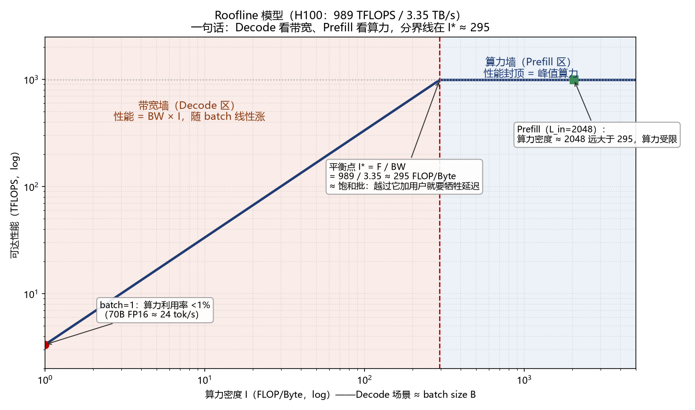

> 本文是《大模型推理案头手册（开源版）》的一章，[← 返回总目录](../../README.md)

---

## 2. 物理层：硬件与模型决定的上限

### 2.1 两个阶段，瓶颈完全不同

|  | Prefill | Decode |
|---|---|---|
| 做什么 | 并行处理全部输入 token | 逐个自回归生成输出 |
| 瓶颈 | 算力（compute-bound） | 显存带宽（memory-bound） |
| 决定指标 | TTFT | TPOT |
| 每 token FLOPs | ≈ 2 × N_active | ≈ 2 × N_active |
| 每 token 访存 | 权重读一次 | 权重（N_total）+ 全量 KV，每步重读 |

E2E = 排队等待 Wq + TTFT_service + L_out × TPOT　（Wq = 排队等待时间；TTFT_service = 不含排队、纯服务过程的首 token 时延）

**【人话】**用户感受到的总时间 ＝ 等位 ＋ 上第一道菜 ＋ 逐口吃完全部菜。

**【代入】**2048 进/512 出（算例 A 口径）：E2E ≈ 排队 ＋ 0.1s ＋ 512×5.7ms ≈ 排队 ＋ 3s——L_out 越大，TPOT 项越主导。

**【直觉】**三段里哪段最大就优化哪段（阿姆达尔）：长输出盯 TPOT，长输入盯 TTFT，高负载盯排队。

**MoE 二分法**：算力侧用激活参数（DeepSeek-V3/R1：37B），访存/显存侧用总参数（671B，全专家常驻）。Dense（稠密）模型两者相等。

### 2.2 Roofline（屋顶线模型）

Roofline（屋顶线模型）：用「峰值算力」和「显存带宽」两条线框出性能上限的经典模型——实际性能只能待在两条线围成的屋顶之下；算力密度（FLOP/Byte）决定你撞的是哪条线。

平衡点算力密度 I* = F / BW（H100：989/3.35 ≈ 295 FLOP/Byte）。（F = 单卡峰值算力，BW = 单卡显存带宽；I* 是「带宽受限/算力受限」的分界线）

**【人话】**I* ＝ GPU 每从显存搬回 1 字节"做得动"的乘加次数。你的实际算力密度低于它 → 带宽受限；高于它 → 算力受限。

**【代入】**H100 的 I*≈295：Decode 每搬 1 字节权重只做 B 次乘加，B=1 时 1≪295，GPU 是搬运工；Prefill 2048≫295，GPU 是计算机。

**【直觉】**所以 Decode 的优化是"把 batch 喂大"（一次搬运服务多人），Prefill 的优化是"堆算力"——方向反了就是负优化。

Decode 算力密度 ≈ batch size B：B<295 纯带宽受限。batch=1 跑 70B FP16（16 位浮点精度，权重 = 70B 参数 × 2 字节 ≈ 140GB）：3.35TB/s ÷ 140GB ≈ 24 tok/s，算力利用率 <1%。

Prefill（L_in=2048）算力密度 ≈ 2048 ≫ 295：算力受限。

**推论 1**：Decode 靠 continuous batching（连续批处理：跑完一条立即插入新请求，batch 始终保持满）把 B 堆大；但 KV 读取随 B 线性增长，长上下文下 KV 会超过权重成为带宽大头。

**推论 2**：Prefill 与 Decode 互相抢算力——一次 2048-token prefill = 2048 次 decode 步的算力。漏算这笔账，λ_sat 高估 2~4 倍（量级佐证见 3.3 对照错误算法：35 vs 8.6 QPS）。

**补充：饱和批（saturation batch）与"免费午餐"**（来自科普版 3.4，与 I* 同义换表述）

Decode 卡带宽只在**低 batch** 时成立。把很多请求攒成一个 batch，权重只搬一次却服务了 B 个请求，算术强度上升——总有一个临界 batch，越过它瓶颈从带宽切换到算力，这个临界点就是**饱和批**（数值上 ≈ I*：H100 约 295，RTX 4090 约 82）。它的运营含义极强：

- **batch < 饱和批**：还在带宽墙下，加用户几乎不增加 TPOT——这是免费的吞吐午餐，应尽量把 batch 喂满到这里；
- **batch > 饱和批**：进入算力墙，TPOT 随 batch 线性上涨——再加用户就要牺牲每个人的延迟了。
**补充：框架效率常数的两个口径（防混用）**

科普材料中常见这样一张"框架 MFU 表"：TRT-LLM 0.80 / SGLang 0.70 / vLLM 0.65 / llama.cpp 0.45，以及 decode 效率因子 llama.cpp 0.55~0.70、vLLM 0.75~0.90、TRT-LLM 0.85~0.95。**注意这与容量规划的取值区间（MFU 0.30~0.55、MBU 0.45~0.65，见 2.4）并不矛盾但口径不同**：前者是"单阶段、大批次、理想负载下的峰值可达值"，后者是"混合负载、含调度与通信损耗的规划取值"。**容量规划一律用规划口径并以实测锚定为准**——用峰值口径做规划，等于把预算建在最好的一天上。

**【2026 年最新佐证：算力差 45.6 倍，体验只差 1.42 倍】**LMSYS（SGLang 团队）把 1.6T MoE 的 DeepSeek-V4-Pro 搬上 H20：B300 的 FP4 峰值算力是 H20 的 45.6 倍、带宽只高 67%；针对性优化后 batch=1 生成速度 H20 跑到 271 tok/s，达 B300（383.7 tok/s）的七成——45.6 倍的算力差，只换来 1.42 倍的体验差（L3 公开基准，LMSYS 博客 2026-08）。原因正是本节的账：decode 逐 token 生成时大矩阵都退化成访存受限的小运算，峰值算力没有用武之地，H20 的 ~4.8 TB/s 带宽家底反被吃满。**“跑大模型先看算力”是这个时代最贵的惯性认知。**

### 2.3 KV Cache：并发容量的隐形天花板

kv_per_token = 2(K,V) × n_layers × n_kv_heads × head_dim × bytes_per_elem

T_max = (n_gpu × 显存 × mem_util − 权重 − 预留) / kv_per_token

c_kv  = T_max / (L_in + L_out)

**符号说明**：kv_per_token = 每个 token 占的 KV 缓存字节数；n_layers = 模型层数；n_kv_heads = KV 注意力头数；head_dim = 每个注意力头的维度；bytes_per_elem = 每个数值的字节数（FP16=2、FP8=1）；n_gpu = 单节点 GPU 卡数；mem_util = 显存利用率上限（防碎片，常取 0.85~0.92）；T_max = KV 池最多能容纳的 token 总数（是容量，不是时间！）；c_kv = KV 槽位并发数，即显存能同时装下的请求条数。

**【mem_util 的真实语义——为什么"调低"反而能治 OOM】mem_util 不是"引擎只用 90% 显存、剩下 10% 永远空着"，而是 vLLM 的显存预算上限，且预算会被吃满：启动时扣掉权重后，预算内剩余全部划给 KV 池，一分不留。预算外还有三笔不在账里的开销：驱动与运行时上下文、通信库 buffer（NCCL/HCCL，随并行度膨胀）、CUDA Graph/算子捕获的工作区。三笔合计超过预留部分就 OOM——报错点常在 capture_model（抓图）而非推理本身。所以调低 mem_util ＝ KV 池让座给预算外开销：KV 变浅（c_kv 变小）换启动成功，方向是安全的。实战注（2026-08，910B × GLM5.2 W8A8，PD 分离 D 侧）：mem_util=0.95 时 51.4/61.0GiB 已占，抓图再要 290MiB 即 OOM；降 0.90 让出约 3GiB 后四台全起。排雷：KV 池太浅有两种症状——装不下一条 max_model_len 会启动即报错（fast-fail，日志给 estimated max model length）；装得下但偏浅则运行期排队、不报错，看日志 "Maximum concurrency" 行判断。**

KV/token 速查（FP16）：Qwen2.5-7B 56KB ｜ Llama-3.1-8B 128KB ｜ Qwen2.5-14B 160KB ｜ Qwen2.5-32B/72B、Llama-3.1-70B 320KB ｜ DeepSeek-V3/R1（MLA，多头潜注意力，DeepSeek 的 KV 压缩技术）≈70KB（FP8 减半）。

**数字直觉**：8×H100 跑 72B FP8，KV 池 ≈490GB ≈ 150 万 token；平均 2560 token/请求 → 最多 ~580 条并发。上下文翻倍，并发腰斩——KV 是线性资源。

**【KV 是分页存放的：block 概念（PagedAttention）】KV 池不按请求整条分配，而是切成定长"块"（block）：vLLM 默认 block_size = 16 token/块（vLLM-Ascend 默认 128），按块申请、按块释放。两个后果直接进容量账：① 碎片以块为粒度——请求长度不满一块的零头整块闲置，池子实际可用要打 5~10% 折扣，这正是 T_max 公式里"预留"项的一部分来历；② 前缀缓存以整块为最小命中单位——共享前缀末尾不满一块的部分缓存不住：块越大管理开销越小、但命中粒度越粗，长系统提示词业务要意识到这个取整损耗。**

**【KV 墙的“拆墙”手段：显存零和博弈】**T_max 公式里权重与 KV 共享同一块 HBM——权重多吃一字节，KV 就少一字节，这是零和博弈。所以 c_kv 墙不是命，是可以拆的（LMSYS V4-Pro × H20，L3）：① **权重瘦身**——专家权重以 MXFP4（4-bit 浮点）存储、计算时在线反量化成 FP8 交给现有计算单元（“存算分离”：没有 FP4 单元的卡也能吃到 4-bit 的显存红利）；② **KV 辅助状态压缩**——KV 压缩策略（每 128 token 共享一份压缩摘要）的逐页索引状态本身也吃显存，改为在线维护一份紧凑聚合状态，省下的全部还给 KV 池。两招是**乘法关系**（一个省权重、一个省 KV 辅助结构，作用在显存预算的两边），叠加后单卡 KV 容量最高扩到 10.14 倍，H20 服务 1M 上下文才成为可能。规划用法：拆墙手段落地后，把新的权重字节和 kv_per_token **代回 T_max 公式重算槽位**，别沿用旧常数。

### 2.4 物理层公式汇总

| 量 | 公式 | 说明 |
|---|---|---|
| Prefill FLOPs/请求 | 2 × N_active × L_in | L_in>8K 再加注意力项 ≈2·n_layers·L_in²·d |
| TTFT_service | Prefill_FLOPs / (n·F×MFU) + 固定开销 | MFU 典型 0.30~0.55；开销 10~50ms |
| Decode 每步访存 | N_total×权重字节 + B×ctx×kv_per_token | ctx = L_in + L_out/2 |
| TPOT(B) | 每步访存 / (n·BW×MBU) | MBU 典型 0.55~0.75 |
| 并发槽位 c_kv | T_max / (L_in+L_out) | 显存硬上限 |

【注意力二次项：何时加、加多少】线性项 2×N×L 是"每 token 过一次权重"的钱；注意力还要"每 token 回望全部历史 token"：每层 QKᵀ 与 A·V 两次矩阵乘 ≈ 4·L²·d，全模型 ≈ 2·n_layers·L_in²·d（系数 2 的口径差异可被 MFU 锚定吸收）。d = 注意力总维度 ≈ 头数×头维（MLA 模型 Q 侧展开维度偏大，R1 ≈ 2.4 万，二次项比同档 MHA 更重）。阈值直觉：二次项随 L_in² 涨、线性项只随 L_in 涨，两者之比正比于 L_in——8K 开始抬头，16K 与线性项同量级（671B 级模型 16K 上下文：二次项 ≈1.3×10¹⁵ vs 线性项 ≈1.3×10¹⁵），128K 完全主导。Decode 不加：每步只有 1 个新 token 回望，注意力 FLOPs 相对权重搬运可忽略——decode 撞的是带宽墙不是算力墙。排雷：FlashAttention 省的是显存，不是 FLOPs——二次项一分不少，只是不被显存挤爆。

### 2.5 吞吐的三个口径：单路、系统、产量

| 口径 | 公式 | 回答的问题 | 用途 |
|---|---|---|---|
| 单路速率 | 1 ÷ TPOT(B) | 一个用户每秒看到几个字 | 体验、SLA 承诺 |
| 系统吞吐 | B ÷ TPOT(B) = 并发 × 单路 | 整台机器每秒产多少 token | 产能规划（买卡按这个算） |
| 总产量 | 系统吞吐 × 时间 | 一小时/一天产多少 token | 计费、成本核算 |

**【代入】**（预支算例 A，与 3.3 对账）：TPOT≈5.7ms → 单路 = 1÷0.0057 ≈ 175 tok/s；B≈26 → 系统吞吐 ≈ 26×175 ≈ 4400 tok/s。这个数 3.3 还会再算一遍，两处必须对上——对不上就是哪笔账错了。

**三个坑，各管一种事故**：① **TPOT 是 TPOT(B)**——并发越高每步越慢（3.2 咬尾公式），拿 batch=1 的单路速度乘大并发 = 双重高估；吞吐随 B 涨、单路速度随 B 跌，SLA 是刹车（3.1 墙 2）。② **节点 ≠ 单卡**——TP 下 8 卡是一个整体（权重切开、带宽叠加），4400 tok/s 是节点口径；说"单卡 550"只是摊薄说法，不能拿单卡 3.35TB/s 单独套公式——TP 切分后单卡不独立服务请求。③ **吞吐 ≠ QPS**——拿 decode 吞吐 ÷ L_out 估 QPS = 假装 prefill 免费，2048/512 负载下高估 ~4 倍（3.1 最常见错误）。
