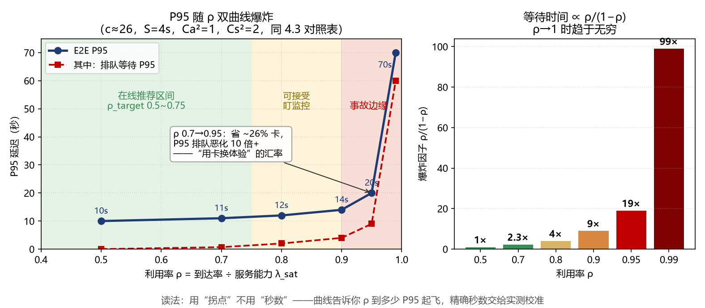
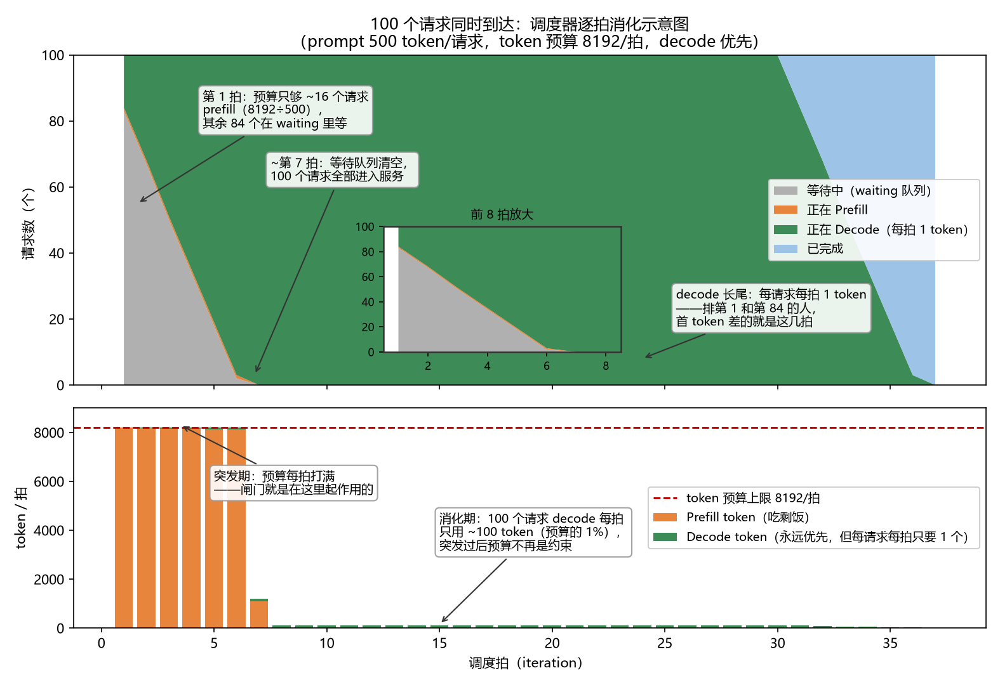

> 本文是《大模型推理案头手册（开源版）》的一章，[← 返回总目录](../../README.md)

---

## 4. 排队层：从”上限”到”真实体验”

### 4.0 排队论三分钟扫盲（看不懂公式的先读这节）

排队论就是研究"窗口前排长队"的数学。你的推理服务是一家银行：请求是顾客，GPU 并发槽位是柜台，排队论回答的问题是——**柜台忙到什么程度，顾客开始骂娘？**

**泊松到达**：顾客"随机来"的标准假设——平均每秒来 λ 个，但具体哪一秒来没法预测，像雨点落地。真实流量比泊松更"扎堆"（见 4.4 自相似），所以泊松是最乐观的起点。

**ρ（读作 rho，利用率）**：到达速度 ÷ 服务能力的比值，ρ=0.7 就是"柜台七成时间在干活"。**本章最重要的一个数**：等待时间不是随 ρ 线性涨，而是随 1/(1−ρ) 爆炸——ρ 从 0.7 到 0.9 等待翻 4 倍，到 0.99 翻 43 倍。这就是"留 buffer 是数学决定的，不是工程能优化掉的"。

**M/M/c**：排队论的型号标注——M=到达随机（泊松）、M=服务时长随机、c=柜台数。看到 M/M/c 就翻译成"c 个柜台、顾客随机来、服务时长不齐"。LLM 服务时长方差太大，不是标准 M，所以要用下面的变异修正。

**Erlang C（埃尔朗-C 公式）**：丹麦工程师埃尔朗一百年前为电话交换机算的公式——"c 个柜台全忙、新顾客必须排队的概率"。它是本章所有 P95 计算的发动机：输入柜台数 c、利用率 ρ、变异程度，输出要等多久。不用背公式，配套计算器会算。

**变异系数 Ca² / Cs²**：衡量"有多不均匀"的数。Ca² 管到达（1=泊松式随机，>1=扎堆突发），Cs² 管服务时长（1=时长还算整齐，3~6=长短请求混部的常态）。排队等待要乘上 (Ca²+Cs²)/2——**不均匀是要付排队税的**，所以定长压测（Cs²=0）是自欺欺人。

**P95 / P99（百分位数）**：P95=2s 意思是"100 个用户里 95 个等得不超 2 秒"。平均值在排队系统里最没信息量——平均 1 秒可能是一半人 0.1 秒、5% 的人 20 秒。给领导的报告只报 P95。

读完这节，4.1 的每个符号你都认识了。

### 4.1 排队模型

到达：泊松过程，率 λ（突发时 Ca²>1）。

排队位置：负载均衡把 λ 均分到 n 节点；**排队主要在节点内部**（waiting 队列）→ 单节点 **M/M/c**，c = 有效并发槽位（≈λ_sat×S，算例 A 中 c≈26），非指数服务用 Allen–Cunneen 变异修正。

利用率 **ρ = λ_node/λ_sat < 1**（稳定条件）。

### 4.2 核心公式

Allen–Cunneen：E[Wq] ≈ C(c,a) × (S/c)/(1−ρ) × (Ca²+Cs²)/2      （a = ρc）　（C(c,a) = Erlang C 等待概率；a = ρc 是流量强度，单位 Erlangs（厄兰））

Erlang C    ：C = B/(1−ρ(1−B))，B 由递推 B(k)=a·B(k−1)/(k+a·B(k−1)) 稳定求解

P95 等待    ：t95_q = ln(20×C) × S/(c−a)

【ln(20×C) 里的 20 从哪来】等待时间近似指数衰减：P(等待 > t) ≈ C·e^(−t·(c−a)/S)。P95 的定义是右尾只剩 5%：令 C·e^(−t·(c−a)/S) = 0.05，解得 t95 = ln(C÷0.05)×S/(c−a) = ln(20×C)×S/(c−a)。20 = 1÷0.05，就是"P95"三个字的数学化身——要 P99，把 20 换成 100 即可。

E2E_P95     ≈ t95_q×(Ca²+Cs²)/2 + S + 1.645×√Cs²×S　（t95_q = 排队等待的 P95；1.645 = 正态分布的 95 分位系数，用于把均值换算成 P95）

TTFT_P95    ≈ t95_q×(Ca²+Cs²)/2 + TTFT_service×1.3

【×1.3 的来历】TTFT_service 是均值；P95 用户命中的输入更长，TTFT 分布右偏，服务项自身也要乘一个 P95/均值放大系数。1.3 是经验取值（区间 1.2~1.5），其误差远小于排队项在 ρ 拐点附近的波动——它不决定拐点位置，只影响秒数的第二位有效数字。有真实 L_in 分布时，改用 P95 输入长度直接算 TTFT_service 更准，可甩掉这个系数。（档案卡见 5.1）

爆炸因子    ：ρ/(1−ρ)：0.5→1，0.7→2.3，0.9→9，0.95→19，0.99→99

**这两条公式是保守近似，用其“拐点”不用其“秒数”**：LLM 的服务时长其实是调度器决定的确定性耦合函数（S = TTFT + L_out×TPOT(B)，B 又反过来取决于 λ），并非随机变量——M/M/c + Allen-Cunneen 的真正价值是秒级给出“P95 在 ρ 多少时起飞”的拐点位置和参数敏感性（ρ 从 0.7 调到 0.85 省多少卡、恶化多少延迟），精确秒数交给第 6 章仿真与两阶段工作流（6.4）校验，误差预算见 5.3。另：**c < 10 的小池（MoE 长上下文常见）近似保守度下降，ρ > 0.6 时误差可 >20%**，建议用 Erlang C 精确递推或 DES（离散事件仿真）校验——8.4 节 ρ_target 取 0.5 的定量依据即此。

实证脚注（2026.08，国产 64 卡 MoE PD 分离，753B 量级，开环爬坡 0.02→0.8 QPS）：ITL P50 全程平滑上升（66.6→256ms，无拐点）——服务内时长是 decode batch 的确定性耦合；TTFT P99 在 ρ 拐点后起飞（6.0→30.2→53.5s）——1/(1−ρ) 爆炸出现在 waiting 排队位。**"S 是确定性耦合函数、爆炸在排队侧"获实测支持。**

**【人话】**上面那组公式翻译过来：排队等待 ＝ "前面有人的概率"(Erlang C) × "人均服务时长"(S/c) × "不均匀税"((Ca²+Cs²)/2) ÷ (1−ρ)。

**【代入】**ρ 从 0.7→0.9：仅 1/(1−ρ) 这一项就把等待放大 3 倍多，叠加爆炸因子翻 4 倍；ρ=0.99 翻 43 倍。

**【直觉】**公式交给计算器，你只管两件事：拐点在哪个 ρ、参数敏感不敏感。这正是"留 buffer 是数学决定的，不是工程能优化掉的"的出处。

### 4.3 ρ ~ P95 对照表（c≈26，S=4s，Ca²=1，Cs²=2）

| ρ | 爆炸因子 | 排队 P95 | E2E P95 | 结论 |
|---|---|---|---|---|
| 0.50 | 1 | ≈0s | ≈10s | 从容 |
| 0.70 | 2.3 | ≈0.7s | ≈11s | 在线推荐上限 |
| 0.80 | 4 | ≈2s | ≈12s | 可接受，盯监控 |
| 0.90 | 9 | ≈4s | ≈14s | 用户开始骂 |
| 0.95 | 19 | ≈9s | ≈20s | 事故边缘 |
| 0.99 | 99 | ≈60s+ | ≈70s+ | 名义没挂实际挂了 |

**容量规划的本质是”用卡换体验”，汇率由排队论决定**：ρ 0.7→0.95 省 ~26% 卡，P95 排队恶化 10 倍+。（曲线对 c 敏感：c 越小翘得越早。）

### 4.4 峰值系数 PAR

C 端峰谷比 2~5。**按 λ_peak = PAR × λ_avg 规划**：n = ⌈λ_peak/(λ_sat×ρ_target)⌉ + 冗余。

**【人话】**台数公式不是经验值，是不等式"峰值时每台机器都不许忙过 ρ_target"的直接解：n ≥ λ_peak ÷ (λ_sat × ρ_target)，向上取整，再加备胎。

**【代入】**8.4 第一行：⌈5 ÷ (0.7 × 0.5)⌉ ＝ ⌈14.3⌉ ＝ 15 台。

**【直觉】**每个因子堵一种规划事故：λ_peak 堵"按均值规划"，ρ_target 堵"贴天花板跑"，⌈⌉ 堵"买分数台"，冗余堵"假设机器不坏"。

注意真实流量往往是**自相似**的（在长时间尺度上流量形状和自己相似，突发成簇出现而不是孤立点），理论泊松分布会系统性低估峰值——所以峰值系数必须用实测的"峰值÷均值"，不能从理论分布拍。

### 4.5 LLM 特有的六个排队效应

**服务时间重尾**：长请求赖着不走 → 有效 c 缩水，Cs² 可达 3~6。对策：max_tokens 分级、长请求专用池。

**连续批处理队头阻塞**：大 prefill 插入 decode batch 引起 TPOT 抖动。对策：chunked prefill（把超长 prefill 切块分批算）、P/D 分离。

**到达非泊松**：整点/批量调用 Ca²>1。对策：网关削峰、错峰。

**准入控制缺失**：ρ 冲过 1 时吞吐不升反降（KV thrashing，显存颠簸：反复抢占-重算）。对策：硬性并发上限 + 快速拒绝（503）。**好的过载保护 = 主动把 ρ 钳在 0.95 内。**

**用户放弃与重试风暴**：以上公式假设用户无限耐心（排队论的 Erlang C 模型，"死等到底"）；真实用户等不及就放弃（对应排队论的"放弃模型" Erlang-A）——过载时系统不会无限排队，而是**损失请求**。更糟的是放弃后往往重试：到达率被重试放大，形成"越卡越发、越发越卡"的**重试风暴**。这正是"容量预测少了"的真正死法：不是排队变长，是请求被损失还自我加剧。结论与上面一致但更硬：**宁可主动快速拒绝（用户收到明确的 503，可错峰再来），不要被动放弃（用户干等超时，然后骂着重试）**。

**连续批处理的公平性缺失（长短请求陪跑）**：同一个 decode batch 里，长上下文请求每一步的注意力计算/访存都更重，短请求被迫陪跑——引擎默认策略**偏吞吐、不偏公平**：batch 拼得越满，短请求的 TPOT 抖动越大。注意这与上面的“队头阻塞”是两种病：那是 prefill 堵 decode，这是 decode 内部长短不公。对策：按上下文长度分队列/分池、给 decode 设步预算（step budget）、对延迟敏感的短请求业务单独部署小池——本质是把一个混部 M/G/c 拆成几个更同质的池，Cs² 各归各。

### 4.6 微观走查：100 个请求同时到达时，引擎到底在干什么

前面三节给了你排队的"账"，这一节给你排队的"画面"。以 vLLM V1 为例（SGLang 同理，参数名不同），突发 100 个请求（prompt 提示词平均 500 token）同一时刻到达，调度器每个 iteration（迭代步：引擎每做一次前向计算叫一个 iteration）做的事：

**三道闸门**（每个 iteration 都要同时满足）：

| 闸门 | 默认常数（vLLM V1，随版本变，以实测为准） | 含义 |
|---|---|---|
| Token 预算 | max_num_batched_tokens = 8192 | 本 iteration 所有请求合计最多调度 8192 个 token |
| 序列数上限 | max_num_seqs = 1024 | running 队列长度上限，通常不是瓶颈 |
| KV 显存池 | (显存×util − 权重 − 激活 − CUDA Graph 预留（内核调用图占用的显存）) ÷ KV块 | 块不够就触发抢占，见 2.3 |

**时序走查**：

1. **T0**：100 个请求全部进 waiting 队列。max_num_seqs=1024 不拦人，但 token 预算拦：100×500=50,000 ≫ 8,192。

2. **Iteration 1**：只放进约 16 个请求做 prefill（8192÷500），其余 84 个原地等待。——**这就是排队论里"c 个服务台"在引擎里的实体化：token 预算把名义上的无限并发砍成了实际的小 c。**

3. **Iteration 2~6**：剩余 84 个 500-token 请求在 waiting 队列里按序补入——随着先进去的请求 prefill 完成转 decode（每人每 iteration 只占 1 个 token 预算）、早期请求陆续完成释放预算，新 prefill **渐进填充**进来，decode 永远优先分预算、prefill 吃剩饭。注意“交替”是概念描述，实际是随完成事件逐步补入；**chunked prefill（把单个超长请求切成块，如 32K prompt 切成每块 512 token）只在单请求长度 > token 预算时才触发**，本例 500-token 的请求整块进、用不上切块。

4. **Iteration N**：第一批 prefill 完成转 decode（每人每 iteration 只占 1 个 token 预算），waiting 里的新请求得以持续补入，系统进入 4.2 节描述的稳态。

**注意：iteration 时长并不均一**。纯 decode iteration 受带宽限制、时长稳定（如 ~50ms）；含 prefill 的 iteration 受算力限制、时长与 prefill token 数成正比（8000 token 的 prefill 可能 200ms+），后者通常是前者的数倍。突发期的前几个 iteration 明显更慢——下面的估算须用**实测 prefill iteration 时长**，否则 P95 TTFT 偏乐观。

**三条推论**（案头判断用）：

- **首 token 延迟（TTFT）的排队大头在 token 预算，不在 GPU 慢**。第 84 个请求不是算不动，是前 5 个 iteration 没轮到它——P95 TTFT ≈ 排队期间各轮 iteration 时长之和（突发期按实测 prefill iteration 计，见上）。
- **调度策略只决定"谁先受罚"**。FCFS（先来先服务）公平；SGLang 的 LPM（前缀感知调度）让共享前缀的请求先跑，RAG/Agent 场景省 KV；但 W>128 自动降级 FCFS，别指望它救突发。
- **Token 预算排队和 KV 池抢占是两种病，别混治**。预算满 → 请求在 waiting 排队，只涨 TTFT，治理是加卡或调大 budget；KV 池满 → 触发抢占（vLLM V1 默认 Recompute：受害者 KV 块直接丢弃，恢复代价 = 重算整个 prefill，prompt_len × T_prefill；V0 的 Swap 模式序列化到 CPU 内存，恢复代价 = KV_size ÷ PCIe 带宽），系统进入 thrashing、吞吐坍塌，治理是限并发或砍 max_tokens。注意本节走查场景（100×500=5万 token 顶爆 8192 预算，但 KV 池 c_kv≈589 远未满）**只犯了第一种病**——两者治理手段完全不同，误判根因会开错药方。**抢占计数（vllm:num_preemptions_total）持续增长才是 ρ 超标、KV 池告急的现场证据**，对应 4.5 第四条“准入控制缺失”。
**瞬态修正（突发场景的坑）**：4.2 的公式全是**稳态**公式，而本节 t=0 突发 100 请求是**瞬态**冲击——系统尚未到达“到达-服务”平衡，队列在前 N 个 iteration 单调累积，有效服务台数还随 prefill→decode 转换动态变化。后果：**稳态 P95 系统性低估瞬态 P95**，ρ 高、c 小、突发度大时偏差可达 30~50%——“公式说达标、用户骂娘”的根源之一。处置：突发度（Ca² 或实测峰均比）>3 的场景，稳态 P95 乘 **1.3~1.5 瞬态系数**（经验值，按 L4 标注）；要准就用离散事件仿真（DES）把前 30 秒走一遍（路线见第 6 章）。
